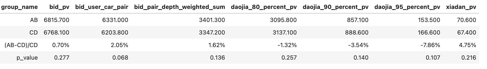

# 【2024-08-14】双塔召回迭代
## 背景
- 新抢拍全召全排性能压力大，尝试用双塔召回(400台)替换全召(3000台)减少排序耗时
- 今日秒杀场景目前有双塔召回，方便对比迭代效果，所以现在这个场景实验验证
- 秒杀双塔现状：只有sparse类特征，向量更新离线任务：人一天一更，车一小时一更

## 结论
08-22 ~ 09-04 14天数据：(已于2024-09-06下线)

## 样本
- 时间：2024-05-10 ~ 2024-07-31(05-10之前出价埋点有问题)
- 正样本：曝光且出价
- 负样本：对每条正样本人车对 从当时的在售车源中随机5台车组成负样本人车对
- 训练-验证-测试集：按时间排序，比例0.8 : 0.1 : 0.1

## 优化过程
| id  | 模型说明 | 测试集acc/auc/gauc|	线上样本auc/gauc |	备注   |
|:------|:----:|------:|------:|------:|
| 1   |  线上  |    | auc: 0.754 gauc: 0.565|
| 2(baseline)   |  全连接relu  | acc: 0.806 auc: 0.847 gauc: 0.845 | auc: 0.629 gauc: 0.615|全连接relu：所有dense层都采用relu作激活函数|
