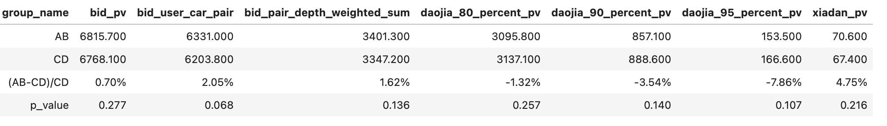
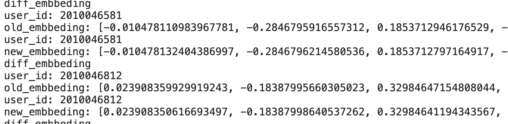
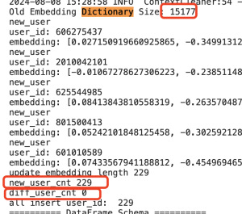

# 【2024-08-14】双塔召回迭代
## 背景
- 新抢拍全召全排性能压力大，尝试用双塔召回(400台)替换全召(3000台)减少排序耗时
- 今日秒杀场景目前有双塔召回，方便对比迭代效果，所以现在这个场景实验验证
- 秒杀双塔现状：只有sparse类特征，向量更新离线任务：人一天一更，车一小时一更

## 结论
08-22 ~ 09-04 14天数据：(已于2024-09-06下线)

## 样本
- 时间：2024-05-10 ~ 2024-07-31(05-10之前出价埋点有问题)
- 正样本：曝光且出价
- 负样本：对每条正样本人车对 从当时的在售车源中随机5台车组成负样本人车对
- 训练-验证-测试集：按时间排序，比例0.8 : 0.1 : 0.1

## 优化过程
| id  | 模型说明 | 测试集acc/auc/gauc|	线上样本auc/gauc |	备注   |
|:---:|:---:|:---:|:---:|:---:|
| 1 | 线上 | | auc: 0.754 gauc: 0.565|
| 2(baseline)|  全连接relu  | acc: 0.806 auc: 0.847 gauc: 0.845 | auc: 0.629 gauc: 0.615|全连接relu：所有dense层都采用relu作激活函数|
| 3 | 全连接tanh | acc: 0.800 auc: 0.877 gauc: 0.882 | auc: 0.647 gauc: 0.660(+0.045)|最后的relu让向量空间变成1/2^32，输出向量的激活函数用tanh让它有正有负|
| 4 | 优化输出层 | acc: 0.871 auc: 0.946 gauc: 0.945 | auc: 0.707 gauc: 0.695(+0.08)|最后输出向量层去掉激活函数，去掉归一化，改为计算内积，不算相似度；原来先过一个tanh把32个数都框在(-1, 1)，再一个归一化把模变成1，这样凸显不出活跃车商跟热门车源，所以auc老是小一截；此番优化大幅提升模型训练表现以及auc|
| 5 | 优化网络结构 | acc: 0.924 auc: 0.962 gauc: 0.959 | auc: 0.724 gauc: 0.705(+0.09)|修改embedding维度n^0.5 → logn，dense特征过的全连接32 → 64|

## 反思复盘
- (已解决)用户特征明明用的全是离线特征，但是隔1个小时刷的用户向量有1700条不同，一共14000条，python的计算精度问题，影响基本在小数点8位之后，解决方法为cos相似度 > 1-1e-6则认为相等，不更新，可过滤100%类似更新
 
- (已解决)线上线下特征不一致；修改离线样本生成口径，把车源基础属性数据源换成实时表
- (已解决)目前每次写数时长20min，按道理应该是每天第一次写入20min，后面都是7、8分钟，现在去重的代码还有点问题，排查中；从pd.read_csv改成spark.read_csv即可
