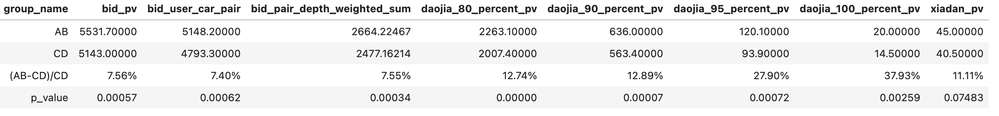
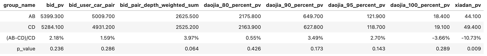

# 【2024-10-28】今日秒杀迭代记录-V2
## 背景
- 上次迭代的版本出价+5.4%，差点显著，再找点优化点看看能否提升
- 工程改造：人车向量都进化成实时更新

## 结论
12-12~12-21数据：出价到价皆显著正向，下单接近显著；12-25在今日秒杀推全

以下为实验组相对对照组的相对提升，皆显著
- pv维度：点击pv+7.76%，出价pv+7.56%，到心理底价80%pv+12.74%、90%pv+12.89%、95%pv+27.90%、100%pv+37.93%
- 车商车源对维度：点击pair+9.70%，出价pair+7.40%，出价pair按出价深度加权 +7.55%，到心理底价80%pair+12.71%、90%pair+12.76%、95%pair+26.20%、100%pair+37.24%
- 车源维度：点击车源+3.96%，出价车源+6.27%，到心理底价80%车源+11.25%、90%车源+11.21%，95%车源+26.01%，到模型价100%车源+37.24%

下单pv+11.11%(p-value = 0.07，40.5 -> 45.0)，预计转全后日均增加9个下单(本次模型新增了车商的历史下单车源序列特征，召回的车整体会和历史下单车源更像)

上线前十天回溯数据12-01~12-10

## 优化过程
数据集时间：数据集09-27 ~ 10-26 (这段时间的出价数&出价率比较接近当前水平)
训练集：验证集：测试集按时间0.8:0.1:0.1
线上样本日期：10-27

| id  | 模型说明 | 测试集acc/auc/gauc|	线上样本auc/gauc |	备注   |
|:---:|:---:|:---:|:---:|:---:|
| 1 | 线上模型 | | (0.749, 0.588)| |
| 2|  上次迭代的baseline模型  | 测试集acc: 0.921, auc: 0.9693, gauc: 0.948 | (0.805, 0.677)|样本：  正样本：出价人车对  负样本：对每条recommend_id、page里的人，有30%的概率随机在售的一台车(正负样本1:3) 特征：  增加dense类特征  emb维度从开根号改成log2n，有提升|
| 3 | 加序列特征 | 测试集acc: 0.933, auc: 0.9776, gauc: 0.9589 | (0.810, 0.681)|gauc提升较小+4‰|
| 4 | 扩充数据集(90天)、优化预处理 | 测试集acc: 0.94, auc: 0.9818, gauc: 0.9671 | (0.832, 0.689)|gauc+1.2%，更换dense seq特征预处理方法，原来是NaN补10个中位数，长度不够10的补本列表的中位数到长度够10；现在改为一律补全局中位数到长度够10|

一些无提升的尝试：
- 新增时间特征：想着车商出价可能有时间偏好，例如早上宝马、晚上奔驰；周一面包车、周无新能源
- 去掉price相关seq特征：出发点是很多新抢拍的车源seller price是0
- 改网络结构：包括增加hidden dim，用self attention抽取序列向量
- 输出32维 -> 64维
