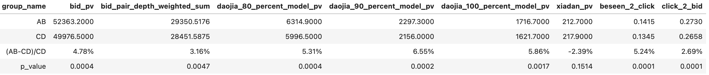
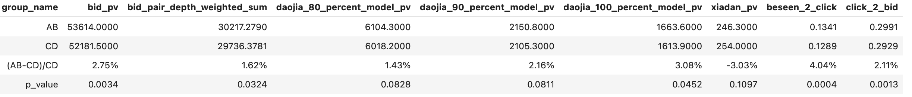

# 【2025-02-06】新抢拍召回迭代
## 背景
- 今日秒杀双塔增加序列特征后出价+7.5%，在新抢拍双塔也加序列试试

## 结论

- 整体出价比实验前约+2%
- 新车商表现更好，约+30%，但是量级比较小
- 经分析，新抢拍场景召回提升空间有限(一半以上的请求召回量不足400台)，需和排序迭代一起实验

02-28~03-09数据：

上线前十天回溯数据02-17~02-26：

实验期间02-28~03-09数据(新车商)：

## 优化过程
数据集时间：数据集12-01 ~ 12-10 (约270w条)
训练集：验证集：测试集按时间0.8:0.1:0.1
线上样本日期：12-20

| id  | 模型说明 | 测试集acc/auc/gauc|	线上样本auc/gauc |	备注   |
|:---:|:---:|:---:|:---:|:---:|
| 1 | 线上模型 | | (0.793, 0.713)| |
| 2|  原始特征重训  | 测试集acc: 0.92, auc: 0.966, gauc: 0.931 | (0.821, 0.709)||
| 3 | 新增序列特征 | 测试集acc: 0.934, auc: 0.976, gauc: 0.950 | (0.841, 0.742)|seq特征直接拼起来送到dense|
| 4 | 优化预处理 | 测试集acc: 0.933, auc: 0.976, gauc: 0.952 | (0.843, 0.754)|更新dense类的预处理，计算均值方差时去掉最大最小的3%异常值，避免归一化后值被框到很小范围|
| 5 | 扩充样本+衰减lr | 测试集acc: 0.935, auc: 0.980, gauc: 0.961 | (0.849, 0.758)|gauc提升4.5%|

一些无提升的尝试：
- 采样：加入热门打压，采成负样本的概率与出价uv正相关
- self-attention处理序列：离线训练时略有提升，但是在真实测试集上表现下降
- 第一次优化预处理时，把去掉头尾3%的特征直接赋值给df对应列了，导致行数错位(原来第80行的特征赋给75行了，最后几行全是nan)

上线后召回分auc/gauc提升约2.5个百分点，排序分auc/gauc与上线前差距不大：

