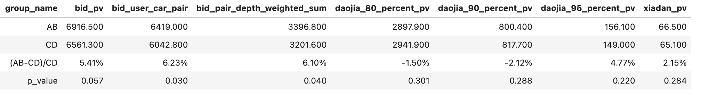
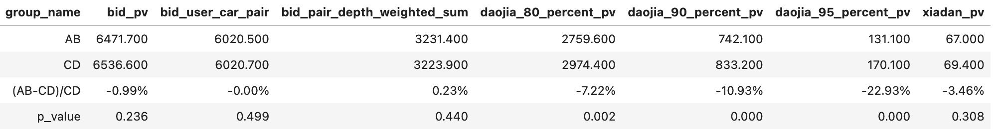

# 【2024-09-19】今日秒杀迭代记录
## 背景
- 新抢拍召回验证了新采样方法的有效性，把它应用到今日秒杀的迭代中来

## 结论
2024-10-12 ~ 2024-10-21 10天数据：出价pv差点显著(p-value=0.057)，10-22下线

- 2024-10-01~2024-10-10回溯数据：国庆节分组不太均匀

## 优化点
样本：
- baseline模型
  - 正样本：出价人车对
  - 负样本：对每条出价人车对里的人，随机在售的三台车
- 新模型
  - 正样本：出价人车对
  - 负样本：对每条recommend_id、page里的人，有30%的概率随机在售的一台车(正负样本1:3)

特征：增加dense类特征
## 离线评测
| id  | 模型说明 | 	线上样本auc/gauc |
|:---:|:---:|:---:|
| 1 | baseline模型，之前出价和线上模型打平 | (0.775, 0.681)| (0.751, 0.772)| 上一版秒杀的采样方法|
| 2 |  新模型，优化采样方法  | (0.820, 0.703 +2.2%) | 