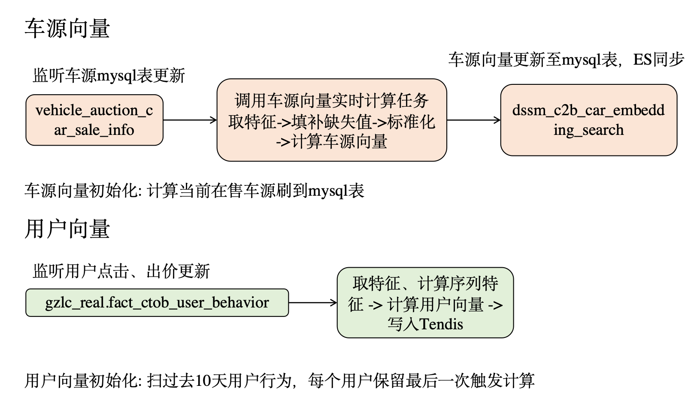
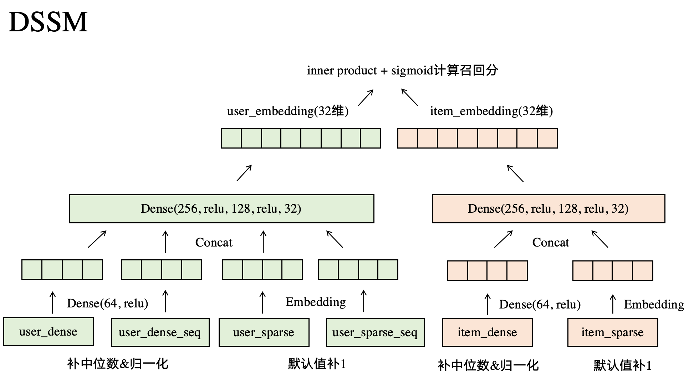

# 双塔召回 pineline说明

## 目录结构
- **etl/**
  - `c2b_dssm_train_samples_search.sql` - 生成训练样本user、item、label三元组
  - `c2b_mtl_test_sample_v1_search.sql` - 全量测试样本生成
  - `c2b_dssm_test_samples_search.sql` - 全量测试样本生成
  - `c2b_dssm_samples_search_step1.sql` - 样本元组join item的sparse、dense特征
  - `c2b_dssm_user_offline_features.sql` - user离线特征生成，包括dense和sparse
  - `c2b_dssm_samples_search_step2.sql` - 样本join user的sparse、dense特征
  - `c2b_dssm_samples_search_step3.sql` - 样本join user的sparse_seq、dense_seq特征

- **sample/**
  - `sample.py`: 生成样本数据，user_id、clue_id、label样本表三元组关联用户特征和车源特征。
  - `run_sample.sh`: spark生成单日样本。
  - `get_multidays_samples_search.sh`: spark生成多日样本，并拉到本地。
  - `preprocessing.py`: 对样本数据进行预处理并保存，样本数据源为本地csv，未进行任何预处理。
  - `preprocessing_new.py`: 对样本数据进行预处理并保存，样本数据源为hive表，已对sparse类特征进行缺失值填补与映射；mode = train时计算各dense特征中位数用于填补缺失值，均值标准差用于归一化并保存为pickle文件；mode = test时加载中位数、均值、标准差进行预处理。

- **train/**
  - `train_dssm_search_old.py`: 预处理旧的特征数据，构建和训练DSSM模型。
  - `train_dssm_search_new.py`: 新增seq类用户特征，代码内进行预处理。
  - `train_dssm_search_processed.py`: 预处理在样本生成时完成，代码只负责训练、测试。

- **inference/**
  - `inference_local.py`: 在本地进行模型推理，生成测试集的用户&物品嵌入向量，用于评估gauc。
  - `inference_local_processed.py`: 比上面的少了一步预处理。
  - `inference_spark_user_search.py`: 使用Spark更新用户向量，以前定时任务更新用。
  - `inference_spark_item_search.py`: 使用Spark更新车源向量，以前定时任务更新用，现在唯一用处是测试刷mysql表后有没有同步到ES。
  - `c2b_recall_refresh_item_search.sh`: 提交spark任务的脚本，用户和车源任务格式类似。
    
- **jupyter/**
  - `今日秒杀双塔召回工具.ipynb`: 承载了多项重要功能包括但不限于：
    - 保存hive表样本到本地供preprocessing_new.py预处理。
    - 离线评估模型gauc、Topn召回率
    - 映射map保存
    - 上线验证，包括下单序列特征线上线下一致性验证；车源、车商向量更新的预处理&打分一致性验证；postman请求向量计算召回分验证
    - 实验期间auc监控
    - 实验分析

- **optimization/**
  - 迭代过程wiki
 

## 运行教程
### 1.配环境
- 本地conda配好环境env，python版本别太高，我用的3.6
- 用conda pack打包环境，不能用tar -czvf，传到hdfs
- 把提交spark任务脚本里的--archives以及下面配置里的环境改成对应的即可
### 2.样本生成
- 原来的样本生成是通过运行get_multidays_samples_search.sh脚本，在spark生成样本并拉到本地，后续改进为etl工作流落到hive表再存成csv到本地
- 对origin data进行预处理存成processed data
### 3.模型训练&测试
- 运行对应的train_xxx.py，保存的user、item模型用于部署
- 运行对应的inference_xxx.py，计算当日所有人车向量，去jupyter里评估模型gauc、Topn召回率
### 4.上线校验
- 线上线下特征一致、映射后encode一致(实时序列能接受线下模拟延迟，防穿越)
- 向量计算一致：同样的模型输入线上线下计算的向量是否一致

