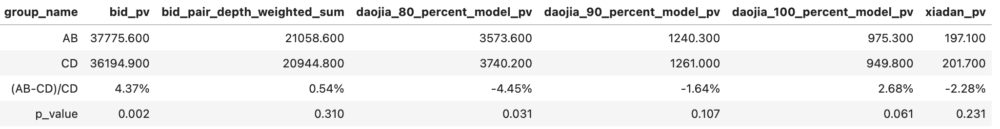

# 【2024-09-03】新抢拍双塔迭代
## 背景
- 新抢拍全召全排性能压力大，尝试用双塔召回(400台)替换全召(3000台)减少排序耗时
- 上一阶段迭代今日秒杀场景出价打平，寻找优化点提示gauc

## 结论
2024-09-20~2024-09-29，10天数据，已于09-30转全
- pv维度：出价pv+10.51%，到模型价100%pv+7.57%
- 车商车源对维度：出价pair+11.94%，出价pair按出价深度加权 +6.60%，到模型价80%pair+3.09%，到模型价90%pair+7.16%，到模型价100%pair+10.37%
- 车源维度：出价车源+7.53%，到模型价90%车源+3.98%，到模型价100%车源+5.50%

- 2024-09-09~2024-09-18回溯数据

## 优化过程
| id  | 模型说明 | 测试集acc/auc/gauc|	线上样本auc/gauc |	备注   |
|:---:|:---:|:---:|:---:|:---:|
| 1 | 正样本：出价人车对 负样本：每个出价人车对随机3台车作为负样本 | acc: 0.896 auc: 0.951 gauc: 0.949| (0.751, 0.772)| 上一版秒杀的采样方法|
| 2|  正样本：出价人车对 负样本：每个点击人车对随机3/8台车作为负样本 3/8是为了保证正负样本比为1:3  | acc: 0.940 auc: 0.961 gauc: 0.951 | (0.8198, 0.7766)|从1、2采样方法得出结论：之前的采样只出现过出过价的车商，不利于模型学到非活跃的车商的负样本|
| 3 | 正样本：出价人车对 负样本：按recommend_id、page采 保证正负样本比为1:3 | acc: 0.926 auc: 0.9674 gauc: 0.9372 | (0.871, 0.783)|auc+12%，gauc+1%；减小样本偏差，与线上分布更接近！|
| 4 | 数据扩充：10天 → 30天 特征替换成线上已有的 | acc: 0.930 auc: 0.971 gauc: 0.943 | (0.874, 0.796)|auc+12.3%，gauc+2.4%|
